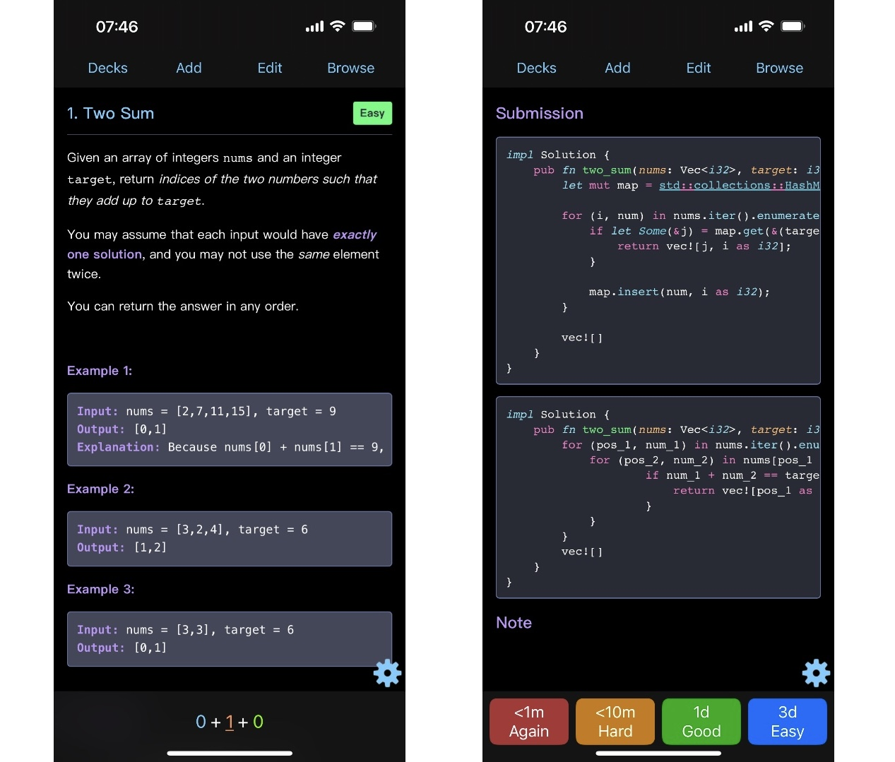

# Lanci

Lanci is a command-line tool that creates Anki cards and Markdown notes for LeetCode problems. It fetches problem details and your submissions from LeetCode, saves them as Markdown files, and generates Anki cards with the problem description and your solution. This may help you prepare for coding interviews by turning practice problems into reviewable flashcards.

## Features

- Fetches problem information (title, description, tags, etc.) from LeetCode.
- Retrieves your own submissions for each problem.
- Saves problem descriptions and your solutions in Markdown format.
- Generates Anki cards.

## Screenshots

Here's how the generated card is displayed in Anki (iOS version):



## Prerequisites

Before using Lanci, make sure you have:

- **[Rust](https://www.rust-lang.org/)** and **[Cargo](https://github.com/rust-lang/cargo)** installed to compile the code.
- **[Anki](https://github.com/ankitects/anki)** installed to import and study the generated cards.
- **[Geckodriver](https://github.com/mozilla/geckodriver)** running to allow scraping from LeetCode.
- A valid **LeetCode cookie** for authentication (to fetch private submissions).

## Installation

1. **Clone this repository**:
   
   ```bash
   git clone https://github.com/1magine/lanci.git
   cd lanci

2. **Build the Project**:

   ```bash
   cargo build --release
   ```

3. **Copy the binary and the configuration** to any directory you prefer:

   ```bash
   cp target/release/lanci /yout/path/
   cp config.json /your/path/
   ```

4. **Start Geckodriver**:

   ```bash
   geckodriver --port 4444
   ```

## Configuration

Lanci reads settings from a `config.json` file. By default, it looks for `config.json` in the same directory as the `lanci` binary. You can specify a different path with the `-c` or `--config` option.

### Example `config.json`

```json
{
  "anki": {
    "model": {
      "id": 1307111927,
      "name": "LeetCode"
    },
    "deck": {
      "id": 2084543157,
      "name": "LeetCode"
    }
  },
  "rate_limit": 1,
  "web_driver": {
    "endpoint": "http://localhost:4444",
    "headless": false
  },
  "cookie": "YOUR_LEETCODE_COOKIE_HERE"
}
```

### Configuration Options

- `anki.model.id`: ID of the Anki model to use (e.g., `1307111927`).
- `anki.model.name`: Name of the Anki model (e.g., `"LeetCode"`).
- `anki.deck.id`: ID of the Anki deck to use (e.g., `2084543157`).
- `anki.deck.name`: Name of the Anki deck (e.g., `"LeetCode"`).
- `rate_limit`: Number of requests per second when fetching data (default: `1`).
- `web_driver.endpoint`: URL of the running WebDriver (default: `"http://localhost:4444"`).
- `web_driver.headless`: Run the browser in headless mode (`true` or `false`, default: `false`).
- `cookie`: Your LeetCode session cookie for authentication (required).

## Usage

Once installed and configured, run Lanci to generate both Markdown notes and Anki cards for a given LeetCode problem URL:

```bash
./lanci --url https://leetcode.com/problems/two-sum/
```

By default, Lanci will:

1. Fetch the problem’s title, description, and tags.
2. Retrieve your accepted submissions for the problem.
3. Save the problem description and your code in a Markdown file
4. Create an Anki package containing the problem.

### Common Options

- `-u, --url <problem_url>`
   LeetCode problem URL (required).
- `-c, --config <path>`
   Path to `config.json` (default: same directory as the `lanci` binary).
- `-o, --output <directory>`
   Output directory for Markdown files and Anki package (default: `./output`).
- `-h, --help`
   Show help information.

## License

This project is licensed under the GNU General Public License v3.0.
See the [LICENSE](./LICENSE) file for details.
